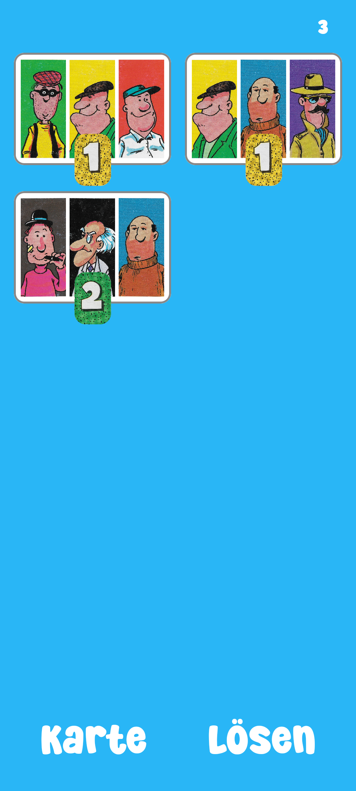
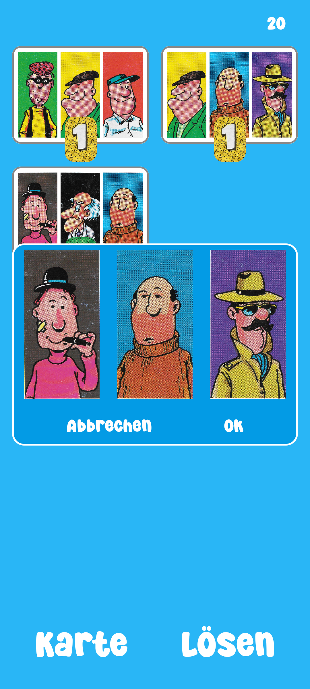

# Gaunertrio

A classic puzzle game for Android, recreating one of my favorite games from childhood.

## About

Gaunertrio is a personal recreation of one of my favorite games when I was a kid. I built this
project out of nostalgia and to practice modern Android development.

## Screenshots

  
   
   
   
   

## Installation

1. Clone this repository
2. Open the project in Android Studio
3. Build and run on your Android device or emulator

## Legal Notice

This is a personal, non-commercial project created for educational and entertainment purposes.
If I violate any rights related to this game, I kindly ask the rights holder to contact me, and I
will address it immediately.

## License

This project is for personal use and educational purposes only.
